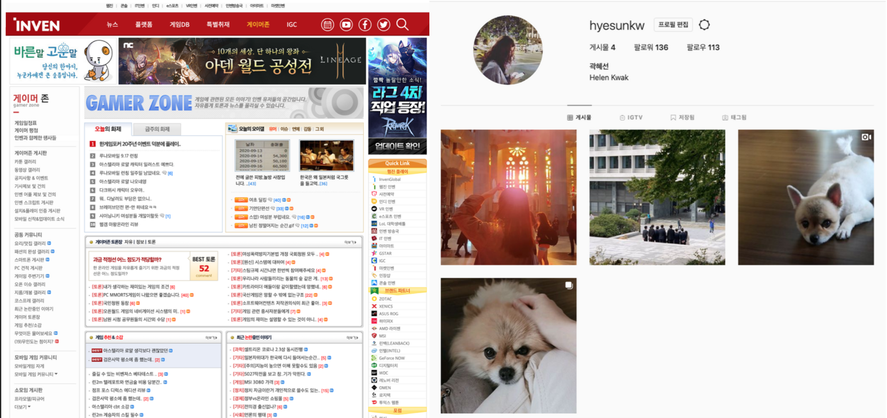

# Requirements and Specification

## Document Revision History
Rev. 1.1 2020-10-17 - Revised in format
* 1.0 : Initial version
* 1.1 : Revised in format

## Project Abstract
**shallWeGame** provides a neat and efficient platform for gamers to share daily game routines. Users can freely show their identities as an active playing gamer by posting their game lives. Also, they can look for other gamers to play with, see posts about games they like, or that their followers have posted. In **shallWeGame**, users can send 'shallWe' privately to whom they hope to play with through posts. We expect our service to be a platform that users actively communicate with other gamers on specific games they like, and easily accessible to those who are interested in games.

## Customer
**shallWeGame** targets ...
* General Customers:
  * People who like to see posts about games

* Specific Customers: 
  * Gamers
    * who likes to share their game lives
    * who wants to find anonymous gamers to play with
    * who likes to see posts about games or gamers they like

## Competitive Landscape
**shallWeGame** is a microblog for gamers. Microblog is a kind of social network service(SNS), which delivers fragmented information with one or two sentences posted by individuals in real-time. In this section, we compare **shallWeGame** with two existing services: 'Instagram', a microblog service, and 'Inven', a non-microblog SNS for gamers.

The characteristics of the two services are specified below.

* Instagram 
  * Instagram is a microblog worldwide which focuses on sharing images. 
  * Users follow people who are their friends in real life.
  * Users follow people who post images they are interested in.
  * Hashtags are used to search posts related to certain topics.
  * Some users posts images and follow others for commercial purposes
  
* Inven
  * Inven is a non-microblog SNS that is actively used by many gamers in Korea. 
  * Bulletin boards are distinguished by games so that users can upload related posts.
  * Posts are relatively long and can contain many images.
  * Users can look for or join game parties by posting on bulletin boards.
  * Information and news about games are provided by journalists or normal users.

  
**shallWeGame** is similar to Instagram in the form of a microblog. Users can share posts with short texts and images. Also, **shallWeGame** borrows the concept of 'follow' in Instagram, so that users form and reinforce social relationships through posts and communication. We expand the use of this functionality for gamers to play games together. If users follow other users, they not only see posts of followers but also invite them to the chatroom.    
**shallWeGame** is alike Inven as SNS for gamers. However, **shallWeGame** limits the form of posts to show posts in a catchy way. Also, unlike Inven, **shallWeGame** provides private space for individuals such that they can express their identity as gamers and share their own gaming lives. Also, users can find other users to play with among their followers or even globally.

To sum up, **shallWeGame** is distinct from the existing services by the following properties:
* **shallWeGame** provides individual spaces for gamers to post their own gaming lives.
* **shallWeGame** provides gamers to find users to play certain games among their followers or globally.
* In **shallWeGame**, users can propose other users to play games with through posts they like.

## User Interface Requirements

## User Stories
### Common Features
> **Story 1**
>	> **Feature:** User wants to watch posts only with clicked tags
>	>
>	> **Actors:** Any users   
>	>
>	> **Precondition:** 
>	> <pre><code>The user must be registered and logged in   
>	> User is recently on Post page or My Page, or the other user’s page</code></pre>
>	>
>	> **Trigger:** User clicks unclicked tag
>	>
>	> **Scenario:**
>	> <pre><code>1. User wants to watch posts with certain tag
>	> 2. User clicks that certain tag
>	> 3. Posts that contains clicked tags are shown to user </code></pre>
>	> 
>	> **Exceptions:** None
>	> 
>	> **Acceptance Test:**
>	> <pre><code>Given that certain tag is recently disabled
>	> When user clicks that tag
>	> Posts that contains that tag are shown to user</code></pre>
> **Story 2**
>	> **Feature:** Users can send “shallWe”
>	>
>	> **Actors:** Any users   
>	>
>	> **Precondition:** 
>	> <pre><code>The user must be registered and logged in   
>	> “shallWe” receiver must have enabled “shallWe”</code></pre>
>	>
>	> **Trigger:** User clicks “shallWe” either on receiver’s post or page
>	>
>	> **Scenario:**
>	> <pre><code>1. User wants to play with someone who is not in user’s friend list
>	> 2. User clicks “shallWe” button which is available in the receiver’s post or page
>	> 3. User enters a chat room
>	> 4. Receiver enters a chatroom if he/she accepts “shallWe” - (1) </code></pre>
>	> 
>	> **Exceptions:**   
>	> <pre><code>(1) Receiver does not enters chatroom if he/she rejects “shallWe”</code></pre>
>	> 
>	> 
>	> **Acceptance Test:**
>	> <pre><code>Given that receiver enabled “shallWe”
>	> When the user clicks the “shallWe” button
>	> User enters chatroom and receiver gets “shallWe”
>	> 
>	> When receiver accepts “shallWe”
>	> Receiver enters the chatroom
>	> 
>	> When user rejects “shallWe”
>	> Nothing happens </code></pre>

### Login page

>
>**Story 1**
>
>>**Feature**: User can sign in
>>
>>**Actors**: Users who not logged in
>>
>>**Precondition**: The user must be registered and not logged in
>>
>>**Trigger**: User clicks 'sign in' button
>>
>>**Scenario**
>><pre><code>1. User wants to sign in
>>2. User enters ID and password input
>>3. User clicks on the 'sign in' button
>>4. Then user logged in and redirected to the main page </code></pre>
>>
>>**Exceptions**: 
>><pre><code>When user enters wrong ID or password, warning alert is appeared and can't logged in</code></pre>
>>
>>**Acceptance Test**: 
>><pre><code>Given user entering ID and password and clicking 'sign in' button 
>> User should sign in and redirected to main-page
>></code></pre>

### My Page
> **Story 1**
>	> **Feature:** User can see post with its tags and contents from post thumbnail
>	>
>	> **Actors:** Any users   
>	>
>	> **Precondition:** 
>	> <pre><code>The user must be registered and logged in   
>	> User is recently on My Page or Friend's Page</code></pre>
>	> 
>	> **Trigger:** User clicks post
>	>
>	> **Scenario:**
>	> <pre><code>1. User wants to see post with its tags and contents
>	> 2. User clicks certain post
>	> 3. Clicked post are zoomed to show its tags and contents
>	> 4. User clicks zoomed post to close zoomed post</code></pre>
>	> 
>	> **Exceptions:** None
>	> 
>	> **Acceptance Test:**
>	> <pre><code>Given that User is recently on My Page or Friend's page
>	> When user clicks certain post
>	> And post is zoomed</code></pre>

### Friends page
> **Story 1**
>	> **Feature:** User wants to follow other user
>	>
>	> **Actors:** Any users   
>	>
>	> **Precondition:** 
>	> <pre><code>The user must be registered and logged in   
>	> User is recently on the other user’s page</code></pre>
>	> 
>	> **Trigger:** User clicks follow button on the other user’s page
>	>
>	> **Scenario:**
>	> <pre><code>1. User wants to follow the other user
>	> 2. User clicks the Follow button on the other user’s page - (1)
>	> 3. The other user should be on the user’s friend list </code></pre>
>	> 
>	> **Exceptions:**   
>	> <pre><code>(1) If the other user is recently on user’s friend list, Follow button for that user is disabled</code></pre>
>	> 
>	> **Acceptance Test:**
>	> <pre><code>Given that the other user is not recently on user’s friend list
>	> When user clicks Follow button on the other user’s page
>	> And the other user is added to user’s friend list</code></pre>
### Chatroom List
> **Story 1**
>	> **Feature:** User can accept “shallWe”   
>	>
>	> **Actors:** Any users   
>	>
>	> **Precondition:** 
>	> <pre><code>The user must be registered and logged in   
>	> User is online and has received more than one “shallWe”</code></pre>
>	> 
>	> **Trigger:** User clicks Sure button
>	>
>	> **Scenario:**
>	> <pre><code>1. User received “shallWe” from the other user - (1)
>	> 2. If user accepts “shallWe” by clicking Sure button,
>	> 3. User enters the chatroom </code></pre>
>	> 
>	> **Exceptions:**
>	> <pre><code>(1) If user is already on the other chatroom, user can’t check out received “shallWe” until user exits recent chatroom</code></pre>
>	> **Acceptance Test:**
>	> <pre><code>Given that user is online, received “shallWe” and recently not in chatroom
>	> When user clicks Sure button
>	> User enters chatroom</code></pre>
> **Story 2**
>	> **Feature:** User creates new chatroom 
>	>
>	> **Actors:** Any users   
>	>
>	> **Precondition:** 
>	> <pre><code>The user must be registered and logged in   
>	> User must be on Chatroom List page</code></pre>
>	> 
>	> **Trigger:** User clicks “Create New Room” button
>	>
>	> **Scenario:**
>	> <pre><code>1. User wants to create a new chatroom
>	> 2. User clicks “Create New Room” button
>	> 3. User enters a new chatroom </code></pre>
>	> 
>	> **Exceptions:** None
>	> 
>	> **Acceptance Test:**
>	> <pre><code>Given that user is recently on Chatrrom List page
>	> When user clicks “Create New Room” button
>	> New chatroom with the user is created</code></pre>
### Setting Page
> **Story 1**
>	> **Feature:** User can delete tags
>	>
>	> **Actors:** Any users   
>	>
>	> **Precondition:** 
>	> <pre><code>The user must be registered and logged in   
>	> User has more than one tag and recently on Setting page</code></pre>
>	> 
>	> **Trigger:** User clicks tag on Setting page
>	>
>	> **Scenario:**
>	> <pre><code>1. User wants to delete certain tag
>	> 2. User deletes tag on Setting page
>	> 3. Deleted tag is not available as a button on all the other pages </code></pre>
>	> 
>	> **Exceptions:** None   
>	> 
>	> **Acceptance Test:**
>	> <pre><code>Given that user is rencently on Setting Page
>	> When user clicks tag to be deleted
>	> User confirms to delete the tag
>	> Now tag button is not avaliable on all the other pages</code></pre>
> **Story 2**
>	> **Feature:** User toggles “shallWe”
>	>
>	> **Actors:** Any users   
>	>
>	> **Precondition:** 
>	> <pre><code>The user must be registered and logged in   
>	> User must be on Setting page</code></pre>
>	> 
>	> **Trigger:** User toggles “shallWe”
>	>
>	> **Scenario:**
>	> <pre><code>1. User wants to enable/disable “shallWe”
>	> 2. User toggles “shallWe” on Setting page
>	> 3. “shallWe” button on user’s posts and on My Page are enabled/disabled </code></pre>
>	> 
>	> **Exceptions:** None   
>	> 
>	> **Acceptance Test:**
>	> <pre><code>Given user enters Setting page for the first time, “shallWe” should be enabled
>	> When user toggles “shallWe”
>	> User confirms to delete the tag
>	> And “shallWe” button on user’s posts and My Page are disabled</code></pre>
### Post Page
> **Story 1**
>	> **Feature:** User can toggle to watch Friend’s posts or Global Post
>	>
>	> **Actors:** Any users   
>	>
>	> **Precondition:** 
>	> <pre><code>The user must be registered and logged in   
>	> User is recently on Post Page and watching Friend’s posts</code></pre>
>	> 
>	> **Trigger:** User toggles to Global posts
>	>
>	> **Scenario:**
>	> <pre><code>1. User wants to watch Global posts
>	> 2. User toggles
>	> 3. User is now watching Global posts which are recommended automatically </code></pre>
>	> 
>	> **Exceptions:** None   
>	> 
>	> **Acceptance Test:**
>	> <pre><code>Given that User is now watching Friend's posts
>	> When user toggles
>	> User is watching recommended Global posts on Post page</code></pre>

### Search page

>**Story 1**
>
>>**Feature**: User can search Friends
>>
>>**Actors**: Any users
>>
>>**Precondition**: The user must be registered and logged in
>>
>>**Trigger**: User clicks on the search tab in menu bar
>>
>>**Scenario**:
>><pre><code>1. Given user wants to search friend
>>2. User fills search bar with friend's name
>>3. User clicks on the 'search' icon
>>4. Then user get the friend's profile</code></pre>
>>
>>**Exceptions**: 
>><pre><code>Nothing happens if search word is empty   
>>Show nothing if there is no result</code></pre>
>>
>>**Acceptance Test**: 
>><pre><code>Given that the user types name in the 'search bar' input 
>>User clicks on the the 'search icon' 
>>User should get the list of friends containing input</code></pre>
>
>**Story 2**
>
>>**Feature**: User can add Friend
>>
>>**Actors**: Any users
>>
>>**Precondition**: 
>><pre><code>The user must be registered and logged in 
>>The target friend must be searched or be recommended to user</code></pre>
>>
>>**Trigger**: User search friend or click search tab in menu bar
>>
>>**Scenario**:
>><pre><code>1. Given user wants to add friend
>>2. User clicks on the 'add friend' icon next to the target friend
>>3. Then user add the target as the new friend
>>4. Then 'add friend' button of target disappear</code></pre>
>>
>>**Exceptions**: 
>><pre><code>None</code></pre>
>>
>>**Acceptance Test**: 
>><pre><code>Given that the user clicks on the 'add friend' icon 
>>User add the target as the new friend
>>Then user should be on search page without 'add friend' button of target</code></pre>
>
>**Story 3**
>
>>**Feature**: User can search game tags
>>
>>**Actors**: Any users
>>
>>**Precondition**: The user must be registered and logged in
>>
>>**Trigger**: User clicks on the Search tab in menu bar
>>
>>**Scenario**:
>><pre><code>1. Given user wants to search game tag
>>2. User fills search bar with name of the game tag
>>3. User clicks on the 'search' icon
>>4. Then user get the profile of the game tag</code></pre>
>>
>>**Exceptions**: 
>><pre><code>Nothing happens if search word is empty 
>>Show nothing if there is no result</code></pre>
>>
>>**Acceptance Test**: 
>><pre><code>Given that the user types name in the 'search bar' input 
>>User clicks on the 'search icon' 
>>User should get the list of game tags containing input</code></pre>
>
>**Story 4**
>
>>**Feature**: User can add game tag
>>
>>**Actors**: Any users
>>
>>**Precondition**: 
>><pre><code>The user must be registered and logged in 
>>The target game tag must be searched or be recommended to user</code></pre>
>>
>>**Trigger**: User search friend or click search tab in menu bar
>>
>>**Scenario**:
>><pre><code>1. Given user wants to add game tag
>>2. User clicks on the 'add game tag' icon next to the target game tag
>>3. Then user add the target as the new game tag.
>>4. User see the popup message "New tag 'tag_name' added!" and list of existing game tags</code></pre>
>>
>>**Exceptions**: 
>><pre><code>None</code></pre>
>>
>>**Acceptance Test**: 
>><pre><code>Given that the user clicks on the 'add game tag' icon 
>>User add the target as the new game tag
>>Then user see popup message "New tag 'tag_name' added!"
>>Then user should be on search page without 'add game tag' button of target</code></pre>

### Chat room page

>**Story 1**
>
>>**Feature**: User can chat with other members in the chat room
>>
>>**Actors**: Any users
>>
>>**Precondition**: 
>><pre><code>The user must be registered and logged in 
>>The user must be joined in chat room</code></pre>
>>
>>**Scenario**:
>><pre><code>1. Given user wants to chat with other members
>>2. User writes a message in the chat input
>>3. User clicks on the 'send' button
>>4. Then all of the members in the chat room should see the message in the chat box</code></pre>
>>
>>**Exceptions**:
>><pre><code>Send button is disabled if chat input is empty</code></pre>
>>
>>**Acceptance Test**
>><pre><code>Given that the user have empty chat input
>>User should not able to click send button because it is disabled
>>When User writes message on chat input
>>Then send button is enabled
>>When User clicks send button
>>Then all of members in the chat room should see the message in the chat box</code></pre>
>
>**Story 2**
>
>>**Feature**: User can invite other friend
>>
>>**Actors**: Any users
>>
>>**Precondition**: 
>><pre><code>The user must be registered and logged in 
>>The user must be joined in chat room
>>The user must have friend not joined in the chat room and online</code></pre>
>>
>>**Scenario**:
>><pre><code>1. Given user wants to invite other friend to the chat room
>>2. User clicks on the 'invite' button
>>3. User choices target friend in the friends list and clicks on the friend's nickname
>>4. Then the target friend is invited to the chat room</code></pre>
>>
>>**Exceptions**:
>><pre><code>Give alert if there is no online friend not joined in the chat room</code></pre>
>>
>>**Acceptance Test**
>><pre><code>Given that the user clicks on the 'invite' button
>>When user doesn't have online friend not joined in the chat room,
>>Then user see alert message 'There is no friend online'
>>When user clicks on the name of friend,
>>Then user invites the target friend to the chat room</code></pre>
>
>**Story 3**
>
>>**Feature**: User can add other members in the chat room to friends
>>
>>**Actors**: Any users
>>
>>**Precondition**: 
>><pre><code>The user must be registered and logged in
>>The user must be joined in chat room
>>There should be other member who is not friend in the chat room</code></pre>
>>
>>**Scenario**:
>><pre><code>1. Given user wants to add other member in the chat room to friend
>>2. User clicks on the 'add friend' button next to the target member
>>3. Then the target member is added to friend</code></pre>
>>
>>**Exceptions**:
>><pre><code>'add friend' button is disabled if all of members in the chat room is already friend</code></pre>
>>
>>**Acceptance Test**
>><pre><code>Given that the user see the 'add friend' button next to the members who is not friend
>>When user clicks on the 'add friend' button next to the target member,
>>Then user add target member to friend
>>User should stay in the chat room after adding friend</code></pre>
>
>**Story 4**
>
>>**Feature**: User can open chat room to public
>>
>>**Actors**: Any users
>>
>>**Precondition**: 
>><pre><code>The user must be registered and logged in 
>>The user must be the host of the chat room</code></pre>
>>
>>**Scenario**:
>><pre><code>1. Given user is the host of the chat room not opened to the public
>>2. User wants to open the chat room to the public
>>3. User toggle switch 'open to everyone' on
>>4. Other users not joined in chat room can see the user's chat room</code></pre>
>>
>>**Exceptions**:
>><pre><code>'open to everyone' switch is disabled if the user isn't host of the room</code></pre>
>>
>>**Acceptance Test**
>><pre><code>Given the user first enters the chat room, 'open to everyone' switch toggle is off
>>Other users not joined in the chat room can't see this chat room
>>When user turn it on,
>>Then other users not joined in the chat room can see this room in the list of chat rooms</code></pre>
>
>**Story 5**
>
>>**Feature**: User can exit the chat room
>>
>>**Actors**: Any users
>>
>>**Precondition**: 
>><pre><code>The user must be registered and logged in 
>>The user must be joined in chat room</code></pre>
>>
>>**Scenario**:
>><pre><code>1. User wants to exit the chat room
>>2. User clicks on the 'exit' button
>>3. Other users not joined in chat room can see the user's chat room</code></pre>
>>
>>**Exceptions**:
>><pre><code>If the user is host of the room, another member of the chat room who joined right after the user be the host</code></pre>
>>
>>**Acceptance Test**
>><pre><code>Given the user first enters the chat room, user can see 'exit' button
>>When user clicks on the 'exit' button,
>>Then user should be on the 'chat room list' page
>>When user who exit is the host of the chat room,
>>Then members of the chat room see next member become the host</code></pre>
